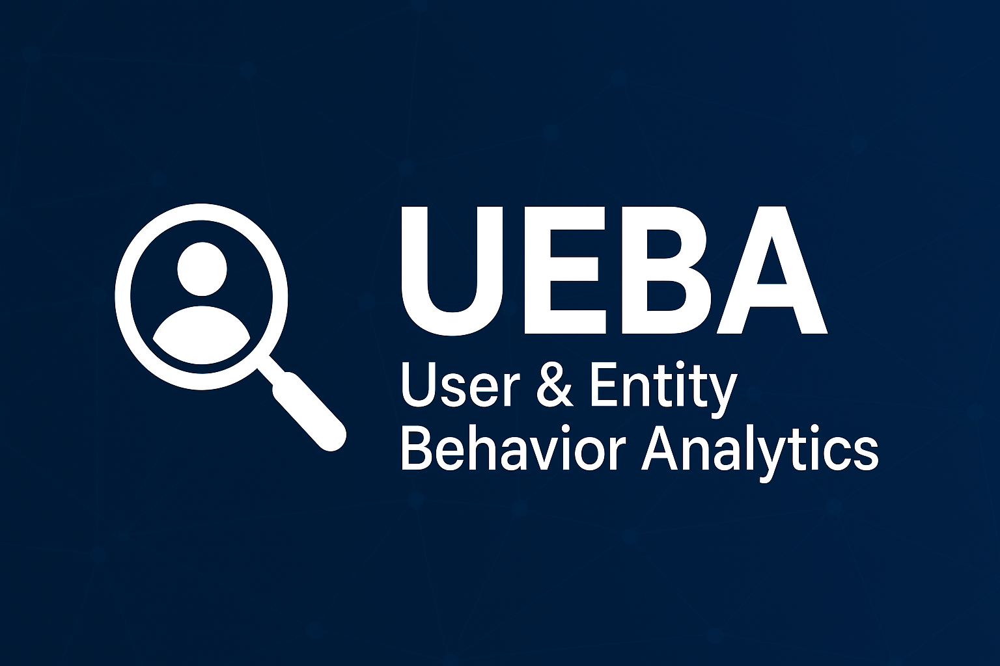

# 🔥 UEBA Graduation Project  

  
  
  
  
  
  

---

## 📋 Project Description  
**User & Entity Behavior Analytics (UEBA)** system for detecting abnormal user and entity behavior by analyzing logins, file access, network activity, and application usage.  
The project combines **rule-based logic** and **machine learning (anomaly detection)** to produce risk scores, real-time alerts, and automated responses (e.g., force MFA, isolate endpoint, disable account).  

**Final Deliverables:** Research, prototype POC, and presentation.  

---

## 🖼️ Banner  
  

---

# UEBA — User & Entity Behavior Analytics  

A research + prototype system to:  
- Collect logs  
- Extract behavioral features  
- Detect anomalies (insider threats, account takeover, data exfiltration)  
- Visualize incidents  
- Perform automated remediation actions  

---

## 🚀 Features  
- Ingest logs from authentication, file access, network flows, and applications.  
- Parse & normalize event data (timestamps, user, IP, device, action).  
- Feature extraction: login cadence, failed-login rates, file download volumes, unusual destinations, new application usage, time-of-day patterns.  
- Baseline modeling & anomaly detection (statistical thresholds, Isolation Forest, clustering).  
- Risk scoring & alert prioritization.  
- Automated action matrix (Low / Medium / High risk): alert, require MFA, isolate endpoint, disable session.  
- Dashboards for visualization (Kibana / Grafana / Flask UI).  
- Competitor & market gap analysis included (slides + documented research).  
- Datasets & EDA notebooks (CERT, LANL, CLUE-LDS examples).  
